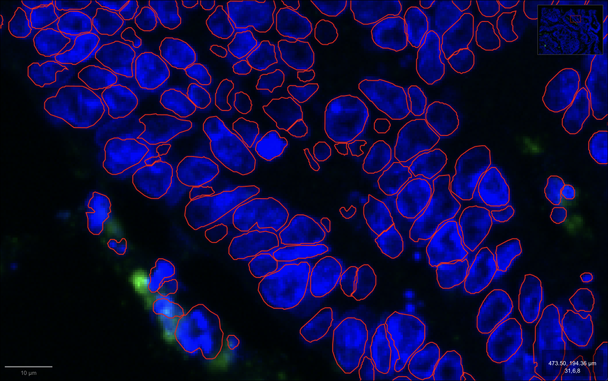
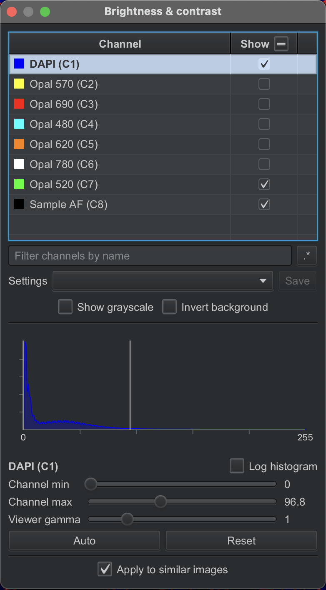
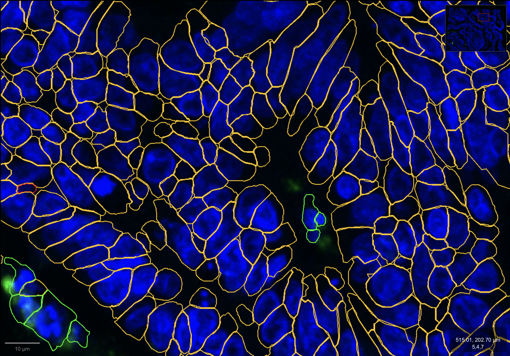
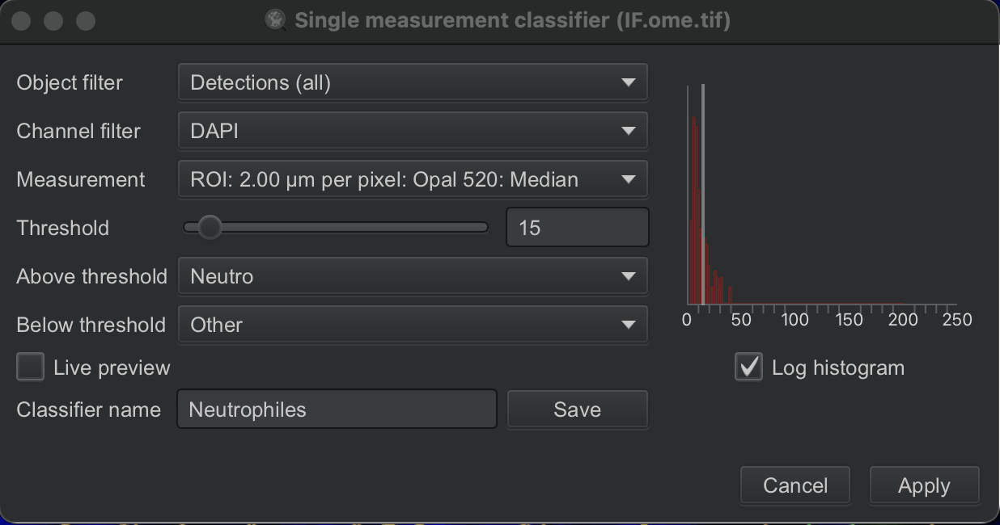
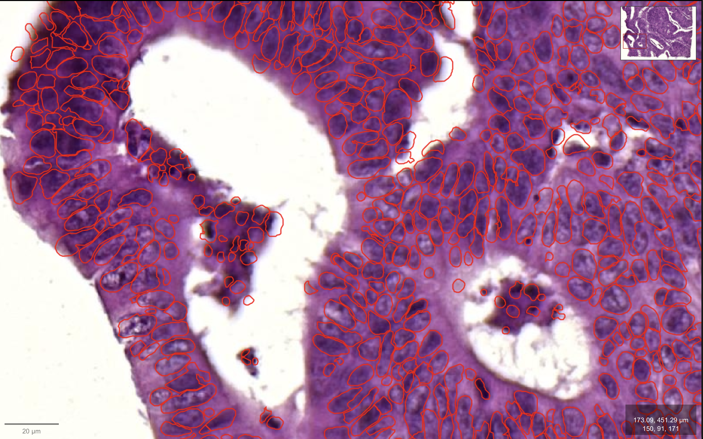

## Imports
```{python}
from pathlib import Path
import matplotlib.pyplot as plt
import spatialdata_io
import os

import xenium_align as xa
```

Here we align the Xenium slide with both the post-Xenium mIF and post-Xenium H&E images, since the same physical slide was imaged across all three technologies. 

But each of these alignments can be run independently, if you have only one of the two post-Xenium images (H&E or mIF), simply run the corresponding section

# Xenium and post xenium mIF
## Paths
```{python Load }
# IF
IF_IMG_PATH = Path("../toy_dataset/IF.ome.tif")
# XENIUM
XE_DIR = Path("../toy_dataset/XENIUM/")
XE_IMG_PATH = xa.data.get_xenium_image_paths(XE_DIR)
# Output directory
output_dir_mif = Path("../toydataset_mIF_results")
output_dir_mif.mkdir(parents=True, exist_ok=True)
```

## Load images and metada
To avoid long processing times, we load each image at a reduced resolution. Since the IF and Xenium images are acquired on different microscopes, they have different native pixel spacings (µm/px). Each image's resolution level is therefore selected automatically to match a common target resolution (2 µm/px by default), chosen as a trade-off between alignment accuracy and computing time.

For both Xenium and post xenium mIF we exctract the DAPI channel.

```{python Load }
meta_source, meta_target, offset_x, offset_y, proc_source, proc_target = xa.data.load_images_and_metadata_mif(IF_IMG_PATH, XE_DIR, target_spacing_um = 1)
```

## Visualize images
This helps assess how similar the two images are before running the registration.

```{python}
fig, axes = plt.subplots(1, 2, figsize=(10, 5))
axes[0].imshow(proc_source)
axes[0].axis('off')
axes[0].set_title('Source (mIF)', fontsize=10)
axes[1].imshow(proc_target)
axes[1].axis('off')
axes[1].set_title('Target (Xenium)', fontsize=10)
plt.tight_layout()
plt.savefig(f'{output_dir_mif}/processed_images.png', bbox_inches='tight', pad_inches=0)
```


## Registration
```{python Registration}
# Deformation resolution
ms = 5
# Load source and target images
fixed = xa.data.get_sitk_image(proc_source, meta_source)
moving = xa.data.get_sitk_image(proc_target, meta_target)
# Run registration
moving_rigid, tx_rigid, moving_bspline, tx_bspline = xa.module.run_registration(fixed, moving, output_dir_mif, ms)
# Visualize results
xa.plot.registration_summary(fixed, moving, moving_rigid, moving_bspline, output_dir_mif, ms)
xa.plot.local_deformations(fixed, tx_bspline, output_dir_mif, ms)
```

## Transform
NOTE: The Transform section can be re-run independently of the Registration section (each registration run saves a .tfm transformation file with its mesh size appended to the filename).
However, the "Load images and metadata" section must be executed first to ensure metadata (e.g., `meta_source`, `meta_target`, `offset_x`, `offset_y`) are available.
You also need to specify `ms`, matching the mesh size of the registration run you want to use.

### From mIF (source) to Xenium (target)
We can transform the segmentation of mIF to the Xenium slide. Here we did the segmentation using `Positive cell detection` in QuPath on DAPI mean and with a treshold at 17 (0µm cell expansion). Segmentation can be improved using other tools.

```{python}
mif_nucleus_geojson = Path("../toy_dataset/IF_nucleus_coords.geojson")
## Transform coordinates
xa.module.apply_sitk_transform(mif_nucleus_geojson, output_dir_mif, meta_source, meta_target, ms, offset_x, offset_y)
```

Next, we can use spatial join to match cells between mIF and Xenium.

### From Xenium (target) to mIF (source)
#### Nucleus coordinates
We can also transform nucleus segmentation from Xenium to the post Xenium mIF slide (using the inverse transform).

```{python}
xe_nucleus_geojson = Path("../toy_dataset/XENIUM_nucleus_coords.geojson")
## Transform coordinates
xa.module.apply_sitk_transform(xe_nucleus_geojson, output_dir_mif, meta_source, meta_target, ms, offset_x, offset_y, inverse = True)
```

And then check the alignment accuracy (how well the transformed nucleus segmentation match the DAPI signal of the post Xenium mIF slide) :

{fig-alt="Xenium nucleus segmentation transformedF" fig-align="center"}

**Note:** Since both post-Xenium H&E and mIF are available for this sample, the mIF panel is kept minimal : only one marker in addition to DAPI (Opal 520). So if you want to visualize the transformed nucleus of Xenium in the mIF slide with QuPath, show only the DAPI and Opal 520 channels.

{fig-alt="Channels to show with post xenium mIF" fig-align="center"}

#### Cells coordinates
In the same way, we can transform the cells segmented from the Xenium multimodal segmentation into the post-Xenium mIF space, in order to annotate the cells (instead of relying on classical nuclear expansion).

```{python}
xe_nucleus_geojson = Path("../toy_dataset/XENIUM_cells_coords.geojson")
## Transform coordinates
xa.module.apply_sitk_transform(xe_nucleus_geojson, output_dir_mif, meta_source, meta_target, ms, offset_x, offset_y, inverse = True)
```

Once transformed, the Xenium cell boundaries can be used to extract mIF signal directly. Since each cell keeps its original Xenium ID through the transformation, the mIF annotation can then be joined back onto the cells in their original Xenium coordinates with a simple join on cell ID.

{fig-alt="Xenium cell segmentation transformed" fig-align="center"}

On this example, annotation is done directly in QuPath. The transformed cell boundaries are imported as **detection** objects, which is required for per-cell measurements and thresholding in QuPath. Intensity features (mean, median, etc.) are then computed per channel on each cell's own ROI via `Analyze` -> `Calculate features` -> `Add intensity features...`. 

Cells are finally classified using QuPath's `Object classification` -> `Create single measurement classifier...`, thresholding at 15 on Opal 520: Median to assign each cell a class (Neutrophils vs. Others).

{fig-alt="Qupath classification" fig-align="center"}


# Xenium and post xenium HES
## Paths
```{python Load }
# HE
HE_IMG_PATH = Path("../toy_dataset/HE.ome.tif")
# XENIUM
XE_DIR = Path("../toy_dataset/XENIUM/")
XE_IMG_PATH = xa.data.get_xenium_image_paths(XE_DIR)
# Output directory
output_dir_he = Path("../toydataset_HE_results")
output_dir_he.mkdir(parents=True, exist_ok=True)
```

## Load images and metada
To avoid long processing times, we load each image at a reduced resolution. Since the H&E and Xenium images are acquired on different microscopes, they have different native pixel spacings (µm/px). Each image's resolution level is therefore selected automatically to match a common target resolution (2 µm/px by default), chosen as a trade-off between alignment accuracy and computing time.

For HE/HES images, we try to extract only the hematoxylin channel using `separate_stains` from `skimage.color`. This single-channel nuclear signal is more directly comparable to the DAPI/nuclear channel of the Xenium IF image, which improves registration between the two modalities.

However, color deconvolution is not perfectly specific to HES (HED matrix), some signal from other channels leaks into it. To match this broader signal, we therefore combine multiple Xenium IF channels : DAPI, ATP1A1, and 18S (rather than DAPI alone).

You can also use DAPI alone, or any combination of two channels, if preferred, each combination is automatically saved to its own output folder named after the channels used.

For this toy dataset, since the images to align are smaller, we use a finer target resolution (1 µm/px). We also use only the `DAPI` and `ATP1A` channels of the Xenium IF here, as this combination gives better alignment results at this scale.


```{python Load }
meta_source, meta_target, offset_x, offset_y, proc_source, proc_target, combo_dir, combo_name = xa.data.load_images_and_metadata_he(HE_IMG_PATH, XE_DIR, output_dir_he, target_spacing_um = 1, combo_name = "DAPI_ATP1A")
```

## Visualize images
This helps assess how similar the two images are before running the registration.

```{python}
plt.figure(figsize=(15, 15))
plt.imshow(proc_source)
plt.axis('off')
plt.savefig(f'{combo_dir}/proc_source.png', bbox_inches='tight', pad_inches=0)
plt.close()

plt.figure(figsize=(15, 15))
plt.imshow(proc_target)
plt.axis('off')
plt.savefig(f'{combo_dir}/proc_target.png', bbox_inches='tight', pad_inches=0)
plt.close()

fig, axes = plt.subplots(1, 2, figsize=(10, 5))
axes[0].imshow(proc_source)
axes[0].axis('off')
axes[0].set_title('Source (HE)', fontsize=10)
axes[1].imshow(proc_target)
axes[1].axis('off')
axes[1].set_title('Target (Xenium)', fontsize=10)
plt.tight_layout()
```


## Registration
```{python Registration}
# Deformation resolution
ms = 5
# Load source and target images
fixed = xa.data.get_sitk_image(proc_source, meta_source)
moving = xa.data.get_sitk_image(proc_target, meta_target)
# Run registration
moving_rigid, tx_rigid, moving_bspline, tx_bspline = xa.module.run_registration(fixed, moving, combo_dir, ms)
# Visualize results
xa.plot.registration_summary(fixed, moving, moving_rigid, moving_bspline, combo_dir, ms)
xa.plot.local_deformations(fixed, tx_bspline, combo_dir, ms)
```

## Transform
NOTE: The Transform section can be re-run independently of the Registration section (each registration run saves a .tfm transformation file with its mesh size appended to the filename).
However, the "Load images and metadata" section must be executed first to ensure metadata (e.g., `meta_source`, `meta_target`, `offset_x`, `offset_y`, `combo_dir`) are available.
You also need to specify `ms`, matching the mesh size of the registration run you want to use.


### From HE (source) to xenium (target)
We can transform the segmentation of H&E to the Xenium slide. Here we did the segmentation using `Positive cell detection` in QuPath on Eosin OD mean and with a treshold at 0.01 (0µm cell expansion). Segmentation can be improved using other tools.

```{python}
he_nucleus_geojson = Path("../toy_dataset/HE_nucleus_coords.geojson")
## Transform coordinates
xa.module.apply_sitk_transform(he_nucleus_geojson, combo_dir, meta_source, meta_target, ms, offset_x, offset_y)
```

Next, we can use spatial join to match cells between mIF and Xenium.

### From xenium (target) to HE (source)
We can also transform nucleus segmentation from Xenium to the post Xenium mIF slide (using the inverse transform) to check the alignment accuracy :

```{python}
xe_nucleus_geojson = Path("../toy_dataset/XENIUM_nucleus_coords.geojson")
## Transform coordinates
xa.module.apply_sitk_transform(xe_nucleus_geojson, combo_dir, meta_source, meta_target, ms, offset_x, offset_y, inverse = True)
```

{fig-alt="Xenium nucleus segmentation transformedF" fig-align="center"}


