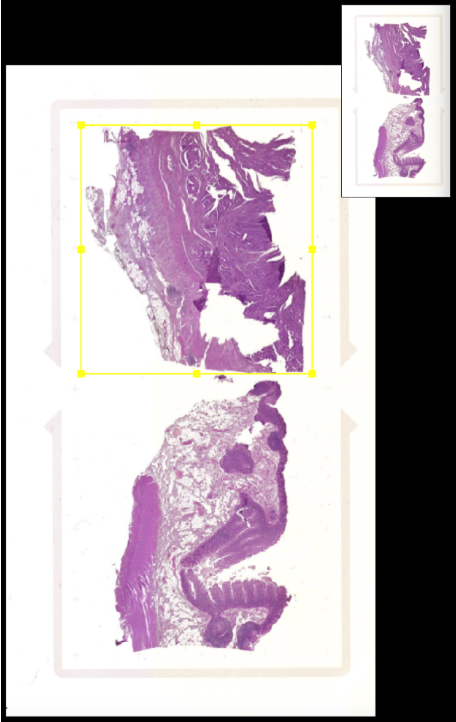
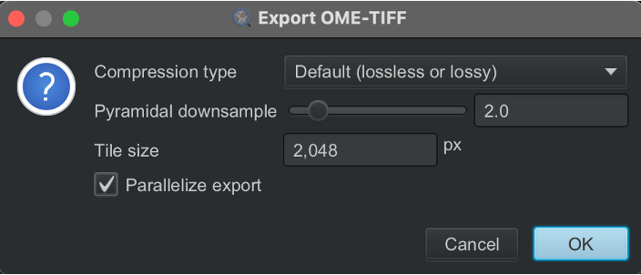

This notebook runs the full alignment pipeline on a complete Xenium slide. It follows the same steps detailed in the [toy dataset example](01_ToyDataset.qmd), refer to it for a step-by-step explanation of the pipeline, with parameters adjusted for whole-slide scale.

It also includes a validation section, comparing the resulting alignment to Xenium Explorer's manual registration, showing comparable accuracy.

## Imports
```{python}
import xenium_align as xa

from pathlib import Path
import os
import matplotlib.pyplot as plt
```

Here we align the Xenium slide with both the post-Xenium mIF and post-Xenium H&E images, since the same physical slide was imaged across all three technologies. 

But each of these alignments can be run independently, if you have only one of the two post-Xenium images (H&E or mIF), simply run the corresponding section.

::: {.callout-warning}
Before running an alignment, the mIF and/or H&E slide must be provided as `ome.tif` and correspond to a **single sample**. 

Indeed, sITK alignment can only be performed between two single-sample images because it relies on global image correlation between the two images being aligned. With multiple samples in the frame, the registration has no way of knowing which sample should match which, and the optimization can converge on a global alignment that doesn't correctly register any single sample.

The Xenium output is typically an `ome.tif` already cropped to a single sample. However, if the original slide contains multiple samples (e.g., two on the same slide), the corresponding H&E and mIF images are likely to share that layout, in which case they need to be cropped to that same single sample for the alignment to be correct.

This per-sample `ome.tif` export can be done in QuPath by defining a squared ROI / annotation around the sample:

{fig-alt="ROI sample for HE" fig-align="center"}

You can export the annotation via `File` → `Export objects as GeoJSON...`, then export the corresponding cropped image via `File` → `Export images...` → `OME-TIFF...`, using:

- Compression: Default (lossless or lossy)
- Pyramidal downsample: 2.0
- Tile size: e.g. 1024 or 2048 px

{fig-alt="Export OME-TIFF parameters" fig-align="center"}

If segmentation, annotation, or downstream analyses were already performed on the full slide (with more than one sample), there's no need to redo them to match the alignment: simply filter the cells falling within the `ROI` and subtract its top-left corner from their coordinates, so they match the cropped image's coordinate system.

Also pay attention to pixel vs. micron units, you can convert between them using each modality's native spacing, available as metadata in the images:
```python
"xenium": 0.2125,
"he": 0.3273,
"mif": 0.4968,
```
:::

# Xenium and post-Xenium mIF
## Paths
```{python Load }
# mIF
IF_IMG_PATH = Path("../COLON_data/IF_HE/IF_colon.ome.tif")
# XENIUM
XE_DIR = Path("../COLON_data/xenium/")
XE_IMG_PATH = xa.data.get_xenium_image_paths(XE_DIR)
# Output directory
output_dir_mif = Path("../COLON_IF_results")
output_dir_mif.mkdir(parents=True, exist_ok=True)
```

## Load images and metadata
```{python Load }
meta_source, meta_target, offset_x, offset_y, proc_source, proc_target = xa.data.load_images_and_metadata_mif(IF_IMG_PATH, XE_DIR)
```

## Visualize images
This helps assess how similar the two images are before running the registration.
```{python}
fig, axes = plt.subplots(1, 2, figsize=(10, 5))
axes[0].imshow(proc_source)
axes[0].axis('off')
axes[0].set_title('Source (mIF)', fontsize=10)
axes[1].imshow(proc_target)
axes[1].axis('off')
axes[1].set_title('Target (Xenium)', fontsize=10)
plt.tight_layout()
plt.savefig(f'{output_dir_mif}/processed_images.png', bbox_inches='tight', pad_inches=0)
```


## Registration
```{python Registration}
# Deformation resolution
ms = 5
# Load source and target images
fixed = xa.data.get_sitk_image(proc_source, meta_source)
moving = xa.data.get_sitk_image(proc_target, meta_target)
# Run registration
moving_rigid, tx_rigid, moving_bspline, tx_bspline = xa.module.run_registration(fixed, moving, output_dir_mif, ms)
# Visualize results
xa.plot.registration_summary(fixed, moving, moving_rigid, moving_bspline, output_dir_mif, ms)
xa.plot.local_deformations(fixed, tx_bspline, output_dir_mif, ms)
```

## Transform with sITK (Rigid + Bspline)
The Transform section can be re-run independently of the Registration section (each registration run saves a .tfm transformation file with its mesh size appended to the filename).
However, the "Load images and metadata" section must be executed first to ensure metadata (e.g., `meta_source`, `meta_target`, `offset_x`, `offset_y`) are available.
You also need to specify `ms`, matching the mesh size of the registration run you want to use.

### From mIF (source) to Xenium (target)
We can transform the segmentation of mIF to the Xenium slide. 

Here we did the segmentation using `Positive cell detection` in QuPath on DAPI mean and with a treshold at 17 (0µm cell expansion). Segmentation can be improved using other tools.

```{python}
if_nucleus_geojson = Path("../COLON_data/IF_HE/IF_colon_segmentation.geojson")
# Transform coordinates
xa.module.apply_sitk_transform(if_nucleus_geojson, output_dir_mif, meta_source, meta_target, ms, offset_x, offset_y)
```

### From xenium (target) to mIF (source)
We export the Xenium nucleus and cell segmentation (or only one of the two using `export_nucleus` / `export_cells` flags) to `.geojson` directly from the raw Xenium output (originally in microns), converting coordinates to pixels. 

Pixel coordinates allow the result to be opened directly in QuPath and compared alongside other annotations / segmentations, each cell remains traceable back to its original Xenium cell ID despite the unit change.

```{python}
## Get xenium nucleus and cells segmentation as .geojson in the output_dir
xa.data.export_xenium_to_pixel_geojson(XE_DIR, meta_target, output_dir_mif)
```

```{python}
xe_nucleus_geojson = Path(output_dir_mif, "XENIUM_nucleus.geojson")
# Transform coordinates
xa.module.apply_sitk_transform(xe_nucleus_geojson, output_dir_mif, meta_source, meta_target, ms, offset_x, offset_y, inverse = True)
```

## Transform with Xenium Explorer (Affine)
### From xenium (target) to mIF (source)
```{python}
# Alignement file from xenium explorer
MATRIX_PATH = Path("../COLON_data/IF_HE/IF_colon_alignment_files/matrix.csv")
# Transform coordinates
xa.module.apply_affine_transform(xe_nucleus_geojson, output_dir_mif, MATRIX_PATH, inverse = True)
```

## Validation
To validate the alignment, we compare the transformed Xenium cell segmentation against the ground-truth mIF segmentation, using Intersection over Ground Truth (IoGT, the fraction of each ground-truth cell's area recovered by the corresponding transformed cell) and centroid distance error (the distance between the transformed cell's centroid and its matched ground-truth cell's centroid).

We first visualize IoGT spatially across cells, then compare the distribution of IoGT and centroid distance error between the sITK (Rigid + Bspline) and Xeniume Explorer (Affine) transformations.

Note that this metrics are highly sensitive to the quality and consistency of both segmentations being compared. Here, the mIF segmentation is approximate, with cell boundaries that highly differ from the Xenium segmentation. As such, IoGT should not be used as a standalone measure of alignment quality, but only to compare transformations relative to one another (e.g., sITK vs. Xenium Explorer) on the same segmentation inputs.

::: {.callout-warning}
If alignment via Xenium Explorer was performed on the full slide (with more than one sample), it cannot be directly compared to the sITK alignment. To make them comparable, first apply the Xenium Explorer transform to the cell coordinates in the full-slide coordinate system, then filter to the cells falling within the `ROI` (saved previously as `.geojson`), and subtract its top-left corner from their coordinates, this brings them into the same coordinate system as the cropped image used for sITK alignment.
:::

## Compute quality metrics
### Definition of the ground thruth
```{python}
he_nucleus_geojson = Path("../COLON_data/IF_HE/IF_colon_segmentation.geojson")
gdf_gt = xa.data.load_gdf_pixel_to_microns(he_nucleus_geojson, meta_source)
```

### sITK
```{python}
transformed_inverse = Path(output_dir_mif, f"XENIUM_nucleus_transformed_inverse_{ms}.geojson")
gdf_pred = xa.data.load_gdf_pixel_to_microns(transformed_inverse, meta_source)
best_matches_sitk = xa.module.match_and_compute_iogt(gdf_pred, gdf_gt)
```

### Affine
```{python}
affine_transformed_inverse = Path(output_dir_mif, "XENIUM_nucleus_transformed_inverse_affine.geojson")
gdf_pred = xa.data.load_gdf_pixel_to_microns(affine_transformed_inverse, meta_source)
best_matches_affine = xa.module.match_and_compute_iogt(gdf_pred, gdf_gt)
```

## Comparison
```{python}
fig, axes = plt.subplots(1, 2, figsize=(18, 8))
xa.plot.plot_spatial_alignment(best_matches_sitk, ax=axes[0], title=f"sITK_{ms}")
xa.plot.plot_spatial_alignment(best_matches_affine, ax=axes[1], title="Affine")
plt.tight_layout()
plt.savefig(os.path.join(output_dir_mif, f"iogt_spatial_comparison_{ms}.png"), dpi=300)

output_iogt_comp = os.path.join(output_dir_mif, f"iogt_benchmark_{ms}.png")
xa.plot.plot_iogt_distribution_comp(best_matches_sitk, "sITK", best_matches_affine, "Affine", output_iogt_comp)
```


# Xenium and post-Xenium H&E
## Paths
```{python Load }
# HE
HE_IMG_PATH = Path("../COLON_data/IF_HE/HE_colon.ome.tif")
#HE_ADATA_PATH = Path("../xenium/1404/AN22001404_01_filtered.h5ad")
# XENIUM
XE_DIR = Path("../COLON_data/xenium/")
#XE_IMG_PATH = xa.data.get_xenium_image_paths(XE_DIR)
# Output directory
output_dir_he = Path("../COLON_HE_results")
output_dir_he.mkdir(parents=True, exist_ok=True)
```

## Load images and metada
```{python Load }
meta_source, meta_target, offset_x, offset_y, proc_source, proc_target, combo_dir, combo_name = xa.data.load_images_and_metadata_he(HE_IMG_PATH, XE_DIR, output_dir_he)
```

## Visualize images
This helps assess how similar the two images are before running the registration.
```{python}
fig, axes = plt.subplots(1, 2, figsize=(10, 5))
axes[0].imshow(proc_source)
axes[0].axis('off')
axes[0].set_title('Source (H&E)', fontsize=10)
axes[1].imshow(proc_target)
axes[1].axis('off')
axes[1].set_title('Target (Xenium)', fontsize=10)
plt.tight_layout()
plt.savefig(f'{combo_dir}/processed_images.png', bbox_inches='tight', pad_inches=0)
```

## Registration
```{python Registration}
# Deformation resolution
ms = 5
# Load source and target images
fixed = xa.data.get_sitk_image(proc_source, meta_source)
moving = xa.data.get_sitk_image(proc_target, meta_target)
# Run registration
moving_rigid, tx_rigid, moving_bspline, tx_bspline = xa.module.run_registration(fixed, moving, combo_dir, ms)
# Visualize results
xa.plot.registration_summary(fixed, moving, moving_rigid, moving_bspline, combo_dir, ms)
xa.plot.local_deformations(fixed, tx_bspline, combo_dir, ms)
```

## Transform with sITK (Rigid + Bspline)
The Transform section can be re-run independently of the Registration section (each registration run saves a .tfm transformation file with its mesh size appended to the filename).
However, the "Load images and metadata" section must be executed first to ensure metadata (e.g., `meta_source`, `meta_target`, `offset_x`, `offset_y`, `combo_dir`) are available.
You also need to specify `ms`, matching the mesh size of the registration run you want to use.

### From HE (source) to xenium (target)
We can transform the segmentation of H&E to the Xenium slide. 

Here we did the segmentation using `Positive cell detection` in QuPath on Hematoxylin OD mean and with a treshold at 0.01 (0µm cell expansion). Segmentation can be improved using other tools.

```{python}
he_nucleus_geojson = Path("../COLON_data/IF_HE/HE_colon_segmentation.geojson")
xa.module.apply_sitk_transform(he_nucleus_geojson, combo_dir, meta_source, meta_target, ms, offset_x, offset_y)
```

### From xenium (target) to HE (source)
We export the Xenium nucleus and cell segmentation (or only one of the two using `export_nucleus` / `export_cells` flags) to `.geojson` directly from the raw Xenium output (originally in microns), converting coordinates to pixels. 

Pixel coordinates allow the result to be opened directly in QuPath and compared alongside other annotations / segmentations, each cell remains traceable back to its original Xenium cell ID despite the unit change.

```{python}
## Get xenium nucleus and cells segmentation as .geojson in the output_dir
xa.data.export_xenium_to_pixel_geojson(XE_DIR, meta_target, combo_dir)
```

```{python}
xe_nucleus_geojson = Path(combo_dir, "XENIUM_nucleus.geojson")
## Transform coordinates
xa.module.apply_sitk_transform(xe_nucleus_geojson, combo_dir, meta_source, meta_target, ms, offset_x, offset_y, inverse = True)
```

## Transform with Xenium Explorer (Affine)
### From xenium (target) to HE (source)
```{python}
## Alignement file from xenium explorer
MATRIX_PATH = Path("../COLON_data/IF_HE/HE_colon_alignment_files/matrix.csv")
## Transform coordinates
xa.module.apply_affine_transform(xe_nucleus_geojson, combo_dir, MATRIX_PATH, inverse = True)
```

# Validation
To validate the alignment, we compare the transformed Xenium cell segmentation against the ground-truth H&E segmentation, using Intersection over Ground Truth (IoGT, the fraction of each ground-truth cell's area recovered by the corresponding transformed cell) and centroid distance error (the distance between the transformed cell's centroid and its matched ground-truth cell's centroid).

We first visualize IoGT spatially across cells, then compare the distribution of IoGT and centroid distance error between the sITK (Rigid + Bspline) and Xeniume Explorer (Affine) transformations.

Note that this metrics are highly sensitive to the quality and consistency of both segmentations being compared. Here, the H&E segmentation is approximate, with cell boundaries that highly differ from the Xenium segmentation. As such, IoGT should not be used as a standalone measure of alignment quality, but only to compare transformations relative to one another (e.g., sITK vs. Xenium Explorer) on the same segmentation inputs.

::: {.callout-warning}
If alignment via Xenium Explorer was performed on the full slide (with more than one sample), it cannot be directly compared to the sITK alignment. To make them comparable, first apply the Xenium Explorer transform to the cell coordinates in the full-slide coordinate system, then filter to the cells falling within the `ROI` (saved previously as `.geojson`), and subtract its top-left corner from their coordinates, this brings them into the same coordinate system as the cropped image used for sITK alignment.
:::


## Compute quality metrics
### Definition of the ground thruth
```{python}
he_nucleus_geojson = Path("../COLON_data/IF_HE/HE_colon_segmentation.geojson")
gdf_gt = xa.data.load_gdf_pixel_to_microns(he_nucleus_geojson, meta_source)
```

### sITK
```{python}
transformed_inverse = Path(combo_dir, f"XENIUM_nucleus_transformed_inverse_{ms}.geojson")
gdf_pred = xa.data.load_gdf_pixel_to_microns(transformed_inverse, meta_source)
best_matches_sitk = xa.module.match_and_compute_iogt(gdf_pred, gdf_gt)
```

### Affine
```{python}
affine_transformed_inverse = Path(combo_dir, "XENIUM_nucleus_transformed_inverse_affine.geojson")
gdf_pred = xa.data.load_gdf_pixel_to_microns(affine_transformed_inverse, meta_source)
best_matches_affine = xa.module.match_and_compute_iogt(gdf_pred, gdf_gt)
```

## Comparison
```{python}
fig, axes = plt.subplots(1, 2, figsize=(18, 8))
xa.plot.plot_spatial_alignment(best_matches_sitk, ax=axes[0], title=f"sITK_{ms}")
xa.plot.plot_spatial_alignment(best_matches_affine, ax=axes[1], title="Affine")
plt.tight_layout()
plt.savefig(os.path.join(combo_dir, f"iogt_spatial_comparison_{ms}.png"), dpi=300)

output_iogt_comp = os.path.join(combo_dir, f"iogt_benchmark_{ms}.png")
xa.plot.plot_iogt_distribution_comp(best_matches_sitk, "sITK", best_matches_affine, "Affine", output_iogt_comp)
```


  


