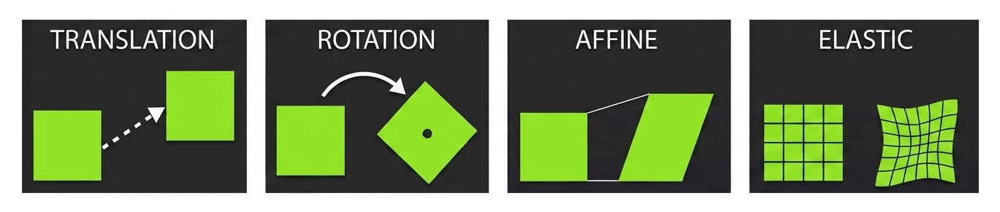

This toolkit provides a pipeline for the **automatic whole slide alignment** between **Xenium** and **post-Xenium** spatial data (mIF, H&E).

### Core Objective
The goal is to bridges the gap between different imaging technologies by mapping annotated cell coordinates from one system to another.

Leveraging **SimpleITK**, the registration process is based on **correlation between image intensities** in two complementary steps:

1.  **Rigid Transformation**: Pre-alignment to correct for rotation and translation.

2.  **Local Deformation (B-Spline)**: Fine-tuning to account for non-linear differences between images.

::: {.callout-note}
## Workflow
The alignment is image-based. Once the registration is finalized, the resulting composite transformation (Rigid + Non-rigid) is applied to spatial annotations (e.g. cell boundaries).
:::

#### Why go beyond Xenium Explorer?
**Image Alignment in Xenium Explorer** requires the user to manually define **anchor points** (landmarks) and relies on **Affine** transformations.

In contrast, this automated approach removes the manual constraints with intensity-based registration. The process can be integrated into end-to-end pipelines, allowing for high-throughput analysis without the need for manual interaction or a graphical interface.

Also, as noted in the [10x Genomics Analysis Guide](https://www.10xgenomics.com/analysis-guides/he-to-xenium-dapi-image-registration-with-fiji):

> "Realistically, two different microscope systems will use different FOV boundaries and different preprocessing... Correcting for lens distortion requires nonlinear transformation and is a fundamentally different problem from image registration."

By using a **B-Spline transformation**, we compensate for the "optical distortion" mentioned by 10x Genomics, resolving local non-linearities that fall outside the scope of a global affine transformation.

{fig-alt="Illustration of transformation types." fig-align="center"}

::: {.callout-note}
## Validation & Comparison
In the [Validation](analysis/03_validation.ipynb) module, we provide tools to compare the composite transformation results against affine alignments, quantifying the gain in precision (IoU, distance error).
:::

### Step-by-Step Pipeline

* **[Data Preparation](analysis/01_preprocessing.qmd)**: Load and format images, cell boundaries (e.g., Xenium outputs).

* **[Image Registration](analysis/02_registration.qmd)**: Automatic alignment using SimpleITK.

* **[Transformation](analysis/02_transformation.qmd)**: Map spatial annotations (such as cell boundaries) into the target coordinate system.

* **[Validation](analysis/03_validation.qmd)**:  Validate the result using IoU and distance error against ground truth segmentation.